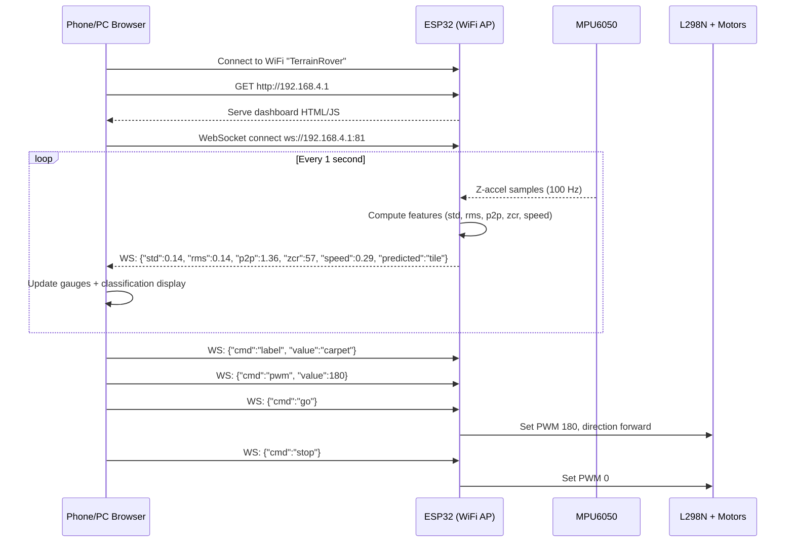

# Hardware Build: ESP32 + L298N + MPU6050 + OLED — Terrain-Aware Rover

## Overview

Wire up the rover hardware (ESP32 DevKit V1 30-pin, L298N dual H-bridge, MPU6050 IMU, SSD1306 OLED, 2× DC motors) and flash firmware that:
1. Drives 2 motors (left side / right side) via L298N at configurable PWM
2. Reads MPU6050 accelerometer at 100 Hz
3. Computes vibration features (std, rms, p2p, zcr, speed) over 1-second windows
4. **Displays live status on an onboard 0.96" OLED** (vibration, terrain, runtime, etc.)
5. **Hosts a WiFi web dashboard** accessible from any phone or PC on the network
6. Sends feature rows over Serial to the PC for ML classification & logging

---

## Wiring Diagram

### Power Supply

> [!IMPORTANT]
> The L298N requires a separate motor power supply (7–12V battery). Do **not** power motors from the ESP32's 3.3V or 5V pin — it will brownout.

| What | Connection |
|------|-----------|
| **Battery +** (7–12V) | L298N `+12V` terminal |
| **Battery −** | L298N `GND` terminal |
| L298N `5V` output (onboard regulator) | ESP32 `VIN` pin (**only if** the 5V jumper on the L298N is in place) |
| L298N `GND` | ESP32 `GND` (**must share ground**) |

> [!NOTE]
> If you have a USB cable plugged into the ESP32 for Serial, it gets power from USB. In that case, remove the 5V jumper on the L298N (don't feed 5V back into VIN while USB is also powering it). Keep the GND connection.

---

### L298N → ESP32 (Motor Control)

| L298N Pin | ESP32 GPIO | Purpose |
|-----------|-----------|---------|
| `IN1` | **GPIO 27** | Left motor direction A |
| `IN2` | **GPIO 26** | Left motor direction B |
| `IN3` | **GPIO 25** | Right motor direction A |
| `IN4` | **GPIO 33** | Right motor direction B |
| `ENA` | **GPIO 14** | Left motor PWM speed (remove jumper!) |
| `ENB` | **GPIO 12** | Right motor PWM speed (remove jumper!) |

> [!WARNING]
> **Remove the ENA and ENB jumpers** on the L298N board. These jumpers lock the enable pins to HIGH (full speed). You must remove them and connect ENA/ENB to ESP32 PWM pins for variable speed control.

#### Motor terminal connections

| L298N Terminal | Wire to |
|---------------|---------|
| `OUT1` | Left motor terminal A |
| `OUT2` | Left motor terminal B |
| `OUT3` | Right motor terminal A |
| `OUT4` | Right motor terminal B |

> [!TIP]
> If a motor spins the wrong direction, swap its two terminal wires (e.g., swap OUT1↔OUT2).

---

### MPU6050 → ESP32 (I²C)

| MPU6050 Pin | ESP32 GPIO | Purpose |
|-------------|-----------|---------|
| `VCC` | **3V3** | Power (MPU6050 works at 3.3V) |
| `GND` | **GND** | Ground |
| `SDA` | **GPIO 21** | I²C data (ESP32 default SDA) |
| `SCL` | **GPIO 22** | I²C clock (ESP32 default SCL) |
| `AD0` | **GND** (or leave unconnected) | I²C address = 0x68 |
| `INT` | Not connected | (optional, not needed for polling) |

---

### SSD1306 OLED (0.96", 128×64, I²C) → ESP32

The OLED **shares the same I²C bus** as the MPU6050 — no extra pins needed. They have different addresses (OLED = `0x3C`, MPU6050 = `0x68`) so they coexist on the same SDA/SCL wires.

| OLED Pin | ESP32 GPIO | Purpose |
|----------|-----------|--------|
| `VCC` | **3V3** | Power (3.3V) |
| `GND` | **GND** | Ground |
| `SDA` | **GPIO 21** | I²C data (same wire as MPU6050) |
| `SCL` | **GPIO 22** | I²C clock (same wire as MPU6050) |

> [!TIP]
> Just wire the OLED's SDA and SCL **in parallel** with the MPU6050's SDA and SCL. Easiest way: use a small breadboard or solder both SDA wires to the same ESP32 GPIO 21 pin, and both SCL wires to GPIO 22.

---

### Complete Wiring Summary

```
                    ┌──────────────┐
  Battery 7-12V ──▶│   L298N      │
  Battery GND   ──▶│              │
                    │  OUT1 ──▶ Left Motor A
                    │  OUT2 ──▶ Left Motor B
                    │  OUT3 ──▶ Right Motor A
                    │  OUT4 ──▶ Right Motor B
                    │              │
                    │  IN1  ◀── GPIO 27
                    │  IN2  ◀── GPIO 26
                    │  IN3  ◀── GPIO 25
                    │  IN4  ◀── GPIO 33
                    │  ENA  ◀── GPIO 14  (remove jumper!)
                    │  ENB  ◀── GPIO 12  (remove jumper!)
                    │  GND  ──▶ ESP32 GND (shared)
                    └──────────────┘

        I²C Bus (shared: GPIO 21 SDA, GPIO 22 SCL)
            ┌──────────────┐   ┌──────────────┐
            │   MPU6050    │   │  SSD1306     │
            │  addr: 0x68  │   │  OLED 0.96"  │
            │  VCC  ◀── 3V3│   │  addr: 0x3C  │
            │  GND  ◀── GND│   │  VCC  ◀── 3V3│
            │  SDA  ◀──┐   │   │  GND  ◀── GND│
            │  SCL  ◀─┐│   │   │  SDA  ◀──┐   │
            │  AD0  ◀─┼┼GND│   │  SCL  ◀─┐│   │
            └─────────┼┼───┘   └─────────┼┼───┘
                      ││                  ││
                      │└── GPIO 21 (SDA) ─┘│
                      └─── GPIO 22 (SCL) ──┘

                    ┌──────────────┐
          USB ──▶   │   ESP32      │  ◀── Serial to PC (data logging)
                    │  DevKit V1   │
                    │  WiFi AP     │  ◀── Phone/PC connects to dashboard
                    │  (30-pin)    │
                    └──────────────┘
```

---

## Proposed Changes

### 1. Firmware

#### [NEW] [`rover_firmware/rover_firmware.ino`](file:///c:/Users/sridh/OneDrive/Documents/terrain-aware/rover_firmware/rover_firmware.ino)

Arduino sketch for ESP32. Core logic:

1. **Setup**: Initialize I²C, configure MPU6050 (±4g range, 100 Hz ODR), **initialize SSD1306 OLED (128×64)**, configure L298N PWM pins (LEDC channels at 1 kHz), **start WiFi Access Point + WebSocket server**
2. **Loop (runs at 100 Hz)**:
   - Read MPU6050 Z-axis acceleration (gravity-removed)
   - Push sample into a 100-element circular buffer (1-second window)
   - Every 100 samples, compute features:
     - `std` — standard deviation of the window
     - `rms` — root mean square
     - `p2p` — peak-to-peak (max − min)
     - `zcr` — zero-crossing rate (number of sign changes)
     - `speed` — derived from current PWM: `pwm * (15.0/255.0) * 0.035`
   - **Update OLED display** with latest features + terrain status
   - **Broadcast** feature JSON to all connected WebSocket clients
   - Print CSV row to Serial: `std,rms,p2p,zcr,speed,pwm,actual_label`
3. **Motor control**: Drive both motors forward at a configurable PWM
4. **WiFi Access Point**: ESP32 creates its own network (`TerrainRover` / password: `rover1234`), serves web dashboard at `http://192.168.4.1`
5. **WebSocket (port 81)**: Bidirectional real-time communication with the web dashboard

**Serial commands** (from PC, still work alongside WiFi):
- `PWM <value>` — set motor speed (0–255)
- `STOP` — emergency stop
- `LABEL <name>` — set the current terrain label
- `GO` — start motors

> [!IMPORTANT]
> The feature extraction (std, rms, p2p, zcr) uses the **exact same formulas** as [`terrain_sim.py`](file:///c:/Users/sridh/OneDrive/Documents/terrain-aware/terrain_sim.py) to ensure the hardware data matches the simulation data format.

---

### 2. OLED Display (Onboard)

The 0.96" SSD1306 OLED shows a **real-time status screen** directly on the rover — no phone needed to see what's happening.

#### OLED Screen Layout (128×64 pixels)

```
┌────────────────────────────────┐
│ TERRAIN-AWARE ROVER    00:02:34│  ← Title + runtime (HH:MM:SS)
├────────────────────────────────┤
│ Actual:    TILE     ← WiFi sel │  ← Terrain you selected via dashboard
│ Predicted: TILE  ✓  ← ML pred │  ← ML model prediction + match icon
├────────────────────────────────┤
│ RMS: 0.141   ZCR: 57          │  ← Key vibration features
│ STD: 0.142   P2P: 1.37        │
├────────────────────────────────┤
│ PWM:180  0.29m/s  WiFi:1  REC●│  ← Motor, speed, clients, recording
└────────────────────────────────┘
```

#### What Each Row Shows

| Row | Content | Update Rate |
|-----|---------|------------|
| **Row 1** | Title + running time since boot | Every 1s |
| **Row 2** | Actual terrain (selected via WiFi dashboard or Serial) | On change |
| **Row 3** | Predicted terrain (from ML classifier) + ✓ match / ✗ mismatch icon | Every 1s |
| **Row 4** | RMS and ZCR vibration features | Every 1s |
| **Row 5** | STD and P2P vibration features | Every 1s |
| **Row 6** | PWM value, speed (m/s), WiFi client count, recording indicator (● when logging) | Every 1s |

> [!NOTE]
> When **predicted ≠ actual**, row 3 shows a **✗** icon and the predicted label **inverts** (white text on black background) to make mismatches visually obvious even at a glance while the rover is moving.

---

### 3. Web Dashboard (Served from ESP32)

#### [NEW] [`rover_firmware/dashboard.h`](file:///c:/Users/sridh/OneDrive/Documents/terrain-aware/rover_firmware/dashboard.h)

The web dashboard HTML/CSS/JS is embedded as a C string in this header file and served by the ESP32's HTTP server. The dashboard is accessible from **any phone or PC browser** connected to the ESP32's WiFi AP.

#### Dashboard Layout

```
┌─────────────────────────────────────────────────┐
│           🚗 TERRAIN-AWARE ROVER                │
│               Live Dashboard                     │
├─────────────────────────────────────────────────┤
│                                                  │
│  ┌─── TERRAIN SELECTOR (Actual) ──────────────┐ │
│  │  [ TILE ]  [ MAT ]  [ CARPET ]  [ GRAVEL ] │ │
│  │       ↑ Tap to label current terrain        │ │
│  └─────────────────────────────────────────────┘ │
│                                                  │
│  ┌─── CLASSIFICATION RESULT ──────────────────┐ │
│  │  Actual:     🟦 TILE                        │ │
│  │  Predicted:  🟩 TILE  ✓ MATCH               │ │
│  │  Confidence: ████████░░ 87%                 │ │
│  └─────────────────────────────────────────────┘ │
│                                                  │
│  ┌─── MOTOR CONTROL ─────────────────────────┐  │
│  │  PWM: ═══════●══════════  [155]            │  │
│  │       0              255                    │  │
│  │  [ ▶ GO ]              [ ⬛ STOP ]          │  │
│  └────────────────────────────────────────────┘  │
│                                                  │
│  ┌─── LIVE VIBRATION FEATURES ───────────────┐  │
│  │  STD:  0.142  ████░░░░░░                   │  │
│  │  RMS:  0.141  ████░░░░░░                   │  │
│  │  P2P:  1.365  ██████████                   │  │
│  │  ZCR:  57     █████████░                   │  │
│  │  Speed: 0.29 m/s                           │  │
│  └────────────────────────────────────────────┘  │
│                                                  │
│  ┌─── DATA LOGGING ─────────────────────────┐   │
│  │  [ ● REC ] Recording... 47 samples logged │   │
│  │  [ ⬇ Download CSV ]                       │   │
│  └────────────────────────────────────────────┘  │
│                                                  │
│         Status: Connected ● │ Uptime: 2m 34s     │
└─────────────────────────────────────────────────┘
```

#### Dashboard Features

| Feature | Description |
|---------|------------|
| **Terrain Selector** | 4 large buttons (Tile / Mat / Carpet / Gravel) to label the terrain the rover is currently on. Selected label is sent to ESP32 and tagged on every data row. Active button is highlighted with the terrain's color. |
| **Classification Result** | Side-by-side display of **Actual** (your label) vs **Predicted** (ML model's output). Shows a ✓ MATCH (green) or ✗ MISMATCH (red) indicator. Confidence bar shows model certainty when available. |
| **Motor Control** | PWM slider (0–255) for setting motor speed. GO / STOP buttons with visual state feedback. Current speed in m/s displayed. |
| **Live Vibration Gauges** | Real-time bar gauges for all 5 features (std, rms, p2p, zcr, speed), updated every 1-second window. Bars are color-coded by terrain prediction. |
| **Data Logging** | Record button starts/stops logging feature rows in-browser. Download button exports the logged session as a CSV file directly to your phone/PC. Sample counter shows how many rows have been collected. |
| **Connection Status** | WebSocket connection indicator (green dot = connected, red = disconnected with auto-reconnect). |

#### How It Works



#### WebSocket Protocol

**ESP32 → Dashboard (every 1s):**
```json
{
  "std": 0.142,
  "rms": 0.141,
  "p2p": 1.365,
  "zcr": 57,
  "speed": 0.288,
  "pwm": 180,
  "actual": "tile",
  "predicted": "tile",
  "uptime": 154
}
```

**Dashboard → ESP32 (on user interaction):**
```json
{"cmd": "label", "value": "carpet"}
{"cmd": "pwm", "value": 200}
{"cmd": "go"}
{"cmd": "stop"}
```

> [!NOTE]
> **Prediction on ESP32**: Initially, the `predicted` field will mirror the `actual` label (no model loaded). Once you train a classifier in MATLAB and determine the winning algorithm, we can either:
> - **(A)** Implement a simple decision tree directly on the ESP32 (low memory, fast)
> - **(B)** Send features to a PC-side Python script that runs the sklearn model and sends the prediction back
>
> Option A is recommended for real-time autonomous operation. Option B is easier for initial testing.

---

### 4. Data Collection Script

#### [NEW] [`rover_firmware/collect_data.py`](file:///c:/Users/sridh/OneDrive/Documents/terrain-aware/rover_firmware/collect_data.py)

Python script to run on PC, connects over Serial (COM port), sends PWM/LABEL commands, and logs incoming feature rows to a CSV file (`hw_dataset.csv`). This lets you:
- Place the rover on each terrain surface
- Run at 3 PWM levels per terrain (matching the simulation protocol)
- Collect real-world vibration features to compare with `ml_dataset.csv`

> [!TIP]
> You can collect data via **both** methods simultaneously:
> - **WiFi dashboard** (phone) → convenient for labeling terrain on-the-go and recording sessions
> - **Serial + collect_data.py** (PC) → higher reliability logging, good for bulk data collection runs

---

### 5. Arduino Libraries Required

| Library | Install via | Purpose |
|---------|-----------|---------|
| `WiFi.h` | Built-in (ESP32 core) | WiFi Access Point |
| `WebServer.h` | Built-in (ESP32 core) | HTTP server for dashboard |
| `WebSocketsServer.h` | Library Manager → "WebSockets" by Markus Sattler | Real-time bidirectional comms |
| `Wire.h` | Built-in | I²C for MPU6050 + OLED |
| `Adafruit_SSD1306.h` | Library Manager → "Adafruit SSD1306" by Adafruit | OLED display driver |
| `Adafruit_GFX.h` | Library Manager → "Adafruit GFX Library" by Adafruit | Graphics primitives (auto-installed with SSD1306) |
| `ArduinoJson.h` | Library Manager → "ArduinoJson" by Benoît Blanchon | JSON serialize/deserialize |

---

## Files Summary

| File | Purpose |
|------|---------|
| `rover_firmware/rover_firmware.ino` | Main Arduino sketch — IMU reading, OLED display, motor control, WiFi AP, WebSocket server |
| `rover_firmware/dashboard.h` | Embedded HTML/CSS/JS for the web dashboard (stored as C string) |
| `rover_firmware/collect_data.py` | PC-side Serial data logger |

---

## Open Questions

> [!IMPORTANT]
> **GPIO 12 caution**: On some ESP32 boards, GPIO 12 is a strapping pin. If the board fails to boot with ENB connected to GPIO 12, switch ENB to **GPIO 13** instead. Let me know if you face boot issues.

> [!NOTE]
> **Motor voltage**: What voltage battery are you using? (e.g., 2S LiPo = 7.4V, 3S = 11.1V, or 4× AA = 6V). This affects whether the L298N's onboard 5V regulator is active (needs >7V input).

---

## Verification Plan

### Hardware Verification (before terrain data collection)
1. **Motor spin test**: Flash firmware → open dashboard on phone → set PWM slider to 100 → tap GO → confirm both motors spin forward
2. **Direction test**: Set PWM to 150 → visually confirm both sides drive the rover forward (swap wires if reversed)
3. **OLED test**: On boot, OLED should show "TERRAIN-AWARE ROVER" title and runtime counting up. If blank, check I²C wiring and that address is 0x3C.
4. **IMU test**: Open Serial Monitor at 115200 baud → observe raw Z-accel values → tap the MPU6050 and see spikes. OLED should show RMS/STD values updating.
5. **Feature sanity check**: Let rover sit still → OLED + dashboard gauges should show near-zero std/rms → shake it → values spike on both screens
6. **WiFi test**: Connect phone to "TerrainRover" WiFi → open `http://192.168.4.1` → confirm dashboard loads and WebSocket connects (green status dot)

### Data Collection Protocol
1. Place rover on **tile** → tap **TILE** on dashboard → set PWM to 180 → tap GO → let it drive 10s → repeat for PWM 220, 255
2. Repeat for **mat** (PWM 150, 190, 230), **carpet** (PWM 135, 170, 205), **gravel** (PWM 100, 130, 165)
3. Tap **⬇ Download CSV** on dashboard to save the session, or use `collect_data.py` for Serial logging → produces `hw_dataset.csv`
4. Compare `hw_dataset.csv` distributions against `ml_dataset.csv` (simulation) to validate the simulation's fidelity

### Dashboard + OLED Verification
1. Tap each terrain button on phone → confirm **both** OLED "Actual:" row and Serial output update to the correct label
2. Slide PWM → confirm motor speed changes in real-time and OLED "PWM:" value updates
3. Tap STOP → confirm motors halt immediately and OLED shows PWM: 0
4. Check predicted vs actual display → initially both should match (no ML model yet) → OLED shows ✓
5. Tap REC → collect 10 samples → OLED shows REC● indicator → tap Download CSV → verify CSV file contents on phone/PC
